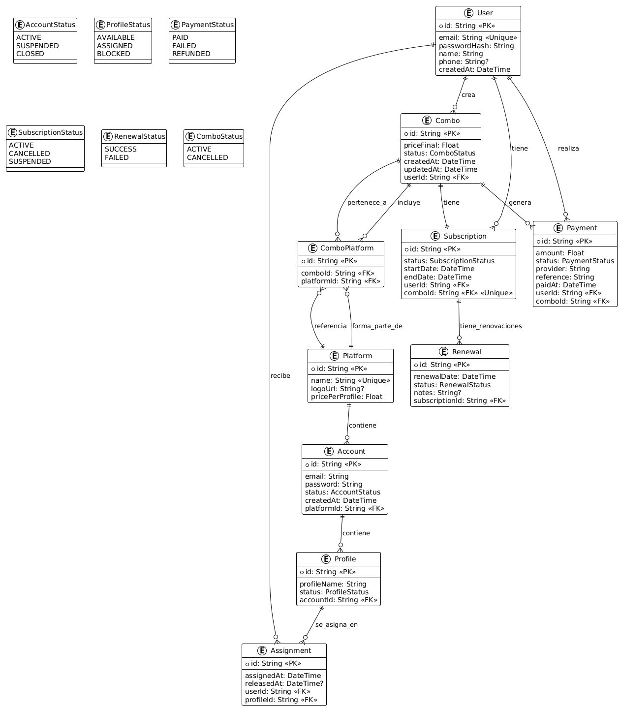

# Revisión de la Base de Datos

Documento con la revisión y explicación de los modelos de base de datos actuales.

## Descripción

Este documento analiza el esquema actual de la base de datos que actualmente está definido en el archivo "schema.prisma", documentando cada modelo, sus campos, relaciones y restricciones.

## Objetivo

El objetivo de este documento es explicar el propósito de cada modelo y cómo se relaciona con las funcionalidades del sistema.

## Ubicación

El código fuente de la base de datos se encuentra en:

```
packages/prisma/schema.prisma
```

## Configuración

- **ORM**: Prisma
- **Base de datos**: PostgreSQL
- **Variable de entorno**: `DATABASE_URL`
- **Cliente**: `prisma-client-js`

---

## Modelos y Relaciones

### User (Usuario)

Almacena la información básica de los usuarios registrados en la plataforma.

**Campos:**

- `id` (String, UUID): Identificador único del usuario
- `email` (String, único): Correo electrónico del usuario
- `passwordHash` (String): Contraseña hasheada
- `name` (String): Nombre del usuario
- `phone` (String, opcional): Teléfono del usuario
- `createdAt` (DateTime): Fecha de creación

**Relaciones:**

- **1:N** con `Combo`: Un usuario puede tener múltiples combos
- **1:N** con `Assignment`: Un usuario puede tener múltiples asignaciones de perfiles
- **1:N** con `Payment`: Un usuario puede tener múltiples pagos
- **1:N** con `Subscription`: Un usuario puede tener múltiples suscripciones

---

### Platform (Plataforma)

Define las plataformas de streaming disponibles (Netflix, Spotify, etc.).

**Campos:**

- `id` (String, UUID): Identificador único de la plataforma
- `name` (String, único): Nombre de la plataforma
- `logoUrl` (String, opcional): URL del logo de la plataforma
- `pricePerProfile` (Float): Precio base por perfil

**Relaciones:**

- **1:N** con `Account`: Una plataforma puede tener múltiples cuentas
- **1:N** con `ComboPlatform`: Una plataforma puede estar en múltiples combos

---

### Combo

Representa la combinación personalizada de plataformas que crea un usuario.

**Campos:**

- `id` (String, UUID): Identificador único del combo
- `userId` (String): Referencia al usuario propietario
- `createdAt` (DateTime): Fecha de creación
- `updatedAt` (DateTime): Fecha de última actualización
- `status` (ComboStatus): Estado del combo (ACTIVE, CANCELLED)
- `priceFinal` (Float): Precio final calculado del combo

**Relaciones:**

- **N:1** con `User`: Pertenece a un usuario
- **1:N** con `ComboPlatform`: Contiene múltiples plataformas
- **1:N** con `Payment`: Puede tener múltiples pagos
- **1:1** con `Subscription`: Tiene una suscripción asociada

---

### ComboPlatform (Plataforma del Combo)

Tabla de relación entre combos y plataformas (many-to-many).

**Campos:**

- `id` (String, UUID): Identificador único
- `comboId` (String): Referencia al combo
- `platformId` (String): Referencia a la plataforma

**Relaciones:**

- **N:1** con `Combo`: Pertenece a un combo
- **N:1** con `Platform`: Referencia a una plataforma

---

### Account (Cuenta)

Cuentas reales de las plataformas que maneja el sistema.

**Campos:**

- `id` (String, UUID): Identificador único de la cuenta
- `platformId` (String): Referencia a la plataforma
- `email` (String): Email de la cuenta
- `password` (String): Contraseña de la cuenta
- `status` (AccountStatus): Estado (ACTIVE, SUSPENDED, CLOSED)
- `createdAt` (DateTime): Fecha de creación

**Relaciones:**

- **N:1** con `Platform`: Pertenece a una plataforma
- **1:N** con `Profile`: Una cuenta puede tener múltiples perfiles

---

### Profile (Perfil)

Perfiles individuales dentro de las cuentas de plataformas.

**Campos:**

- `id` (String, UUID): Identificador único del perfil
- `accountId` (String): Referencia a la cuenta
- `profileName` (String): Nombre del perfil
- `status` (ProfileStatus): Estado (AVAILABLE, ASSIGNED, BLOCKED)

**Relaciones:**

- **N:1** con `Account`: Pertenece a una cuenta
- **1:N** con `Assignment`: Puede tener múltiples asignaciones

---

### Assignment (Asignación)

Asigna perfiles específicos a usuarios que compraron combos.

**Campos:**

- `id` (String, UUID): Identificador único
- `userId` (String): Referencia al usuario
- `profileId` (String): Referencia al perfil
- `assignedAt` (DateTime): Fecha de asignación
- `releasedAt` (DateTime, opcional): Fecha de liberación

**Relaciones:**

- **N:1** con `User`: Pertenece a un usuario
- **N:1** con `Profile`: Referencia a un perfil

---

### Payment (Pago)

Registra los pagos realizados por los usuarios.

**Campos:**

- `id` (String, UUID): Identificador único
- `userId` (String): Referencia al usuario
- `comboId` (String): Referencia al combo
- `amount` (Float): Monto del pago
- `status` (PaymentStatus): Estado (PAID, FAILED, REFUNDED)
- `provider` (String): Proveedor de pago
- `reference` (String): Referencia del pago
- `paidAt` (DateTime): Fecha del pago

**Relaciones:**

- **N:1** con `User`: Pertenece a un usuario
- **N:1** con `Combo`: Asociado a un combo

---

### Subscription (Suscripción)

Gestiona las suscripciones activas de los usuarios.

**Campos:**

- `id` (String, UUID): Identificador único
- `userId` (String): Referencia al usuario
- `comboId` (String, único): Referencia al combo
- `status` (SubscriptionStatus): Estado (ACTIVE, CANCELLED, SUSPENDED)
- `startDate` (DateTime): Fecha de inicio
- `endDate` (DateTime): Fecha de fin

**Relaciones:**

- **N:1** con `User`: Pertenece a un usuario
- **1:1** con `Combo`: Asociada a un combo específico
- **1:N** con `Renewal`: Puede tener múltiples renovaciones

---

### Renewal (Renovación)

Registra las renovaciones de suscripciones.

**Campos:**

- `id` (String, UUID): Identificador único
- `subscriptionId` (String): Referencia a la suscripción
- `renewalDate` (DateTime): Fecha de renovación
- `status` (RenewalStatus): Estado (SUCCESS, FAILED)
- `notes` (String, opcional): Notas adicionales

**Relaciones:**

- **N:1** con `Subscription`: Pertenece a una suscripción

---

## Enumeraciones (Enums)

### ComboStatus

- `ACTIVE`: Combo activo
- `CANCELLED`: Combo cancelado

### AccountStatus

- `ACTIVE`: Cuenta activa
- `SUSPENDED`: Cuenta suspendida
- `CLOSED`: Cuenta cerrada

### ProfileStatus

- `AVAILABLE`: Perfil disponible
- `ASSIGNED`: Perfil asignado
- `BLOCKED`: Perfil bloqueado

### PaymentStatus

- `PAID`: Pago exitoso
- `FAILED`: Pago fallido
- `REFUNDED`: Pago reembolsado

### SubscriptionStatus

- `ACTIVE`: Suscripción activa
- `CANCELLED`: Suscripción cancelada
- `SUSPENDED`: Suscripción suspendida

### RenewalStatus

- `SUCCESS`: Renovación exitosa
- `FAILED`: Renovación fallida

---

## Diagrama de Relaciones

### Diagrama Entidad-Relación (ERD)



### Representación Textual

```
User ||--o{ Combo : "tiene"
User ||--o{ Assignment : "tiene"
User ||--o{ Payment : "realiza"
User ||--o{ Subscription : "tiene"

Platform ||--o{ Account : "contiene"
Platform ||--o{ ComboPlatform : "está en"

Combo ||--o{ ComboPlatform : "incluye"
Combo ||--o{ Payment : "genera"
Combo ||--|| Subscription : "tiene"

Account ||--o{ Profile : "contiene"
Profile ||--o{ Assignment : "asignado a"

Subscription ||--o{ Renewal : "tiene"
```

---

## Consideraciones de Diseño

1. **UUIDs**: Se utilizan identificadores únicos universales para mayor seguridad
2. **Timestamps**: Campos de auditoría con `createdAt` y `updatedAt`
3. **Soft Deletes**: Se usan estados en lugar de eliminación física
4. **Relaciones**: Diseñadas para soportar escalabilidad y flexibilidad
5. **Índices**: Los campos únicos tienen índices automáticos

---

## Notas

- **Actualización**: Mantén este documento sincronizado con cambios en `schema.prisma`
- **Migraciones**: Usa `prisma migrate` para cambios en producción
- **Datos de prueba**: Considera usar `prisma db seed` para datos iniciales
- **Backup**: Implementa estrategias de respaldo para datos críticos

---
