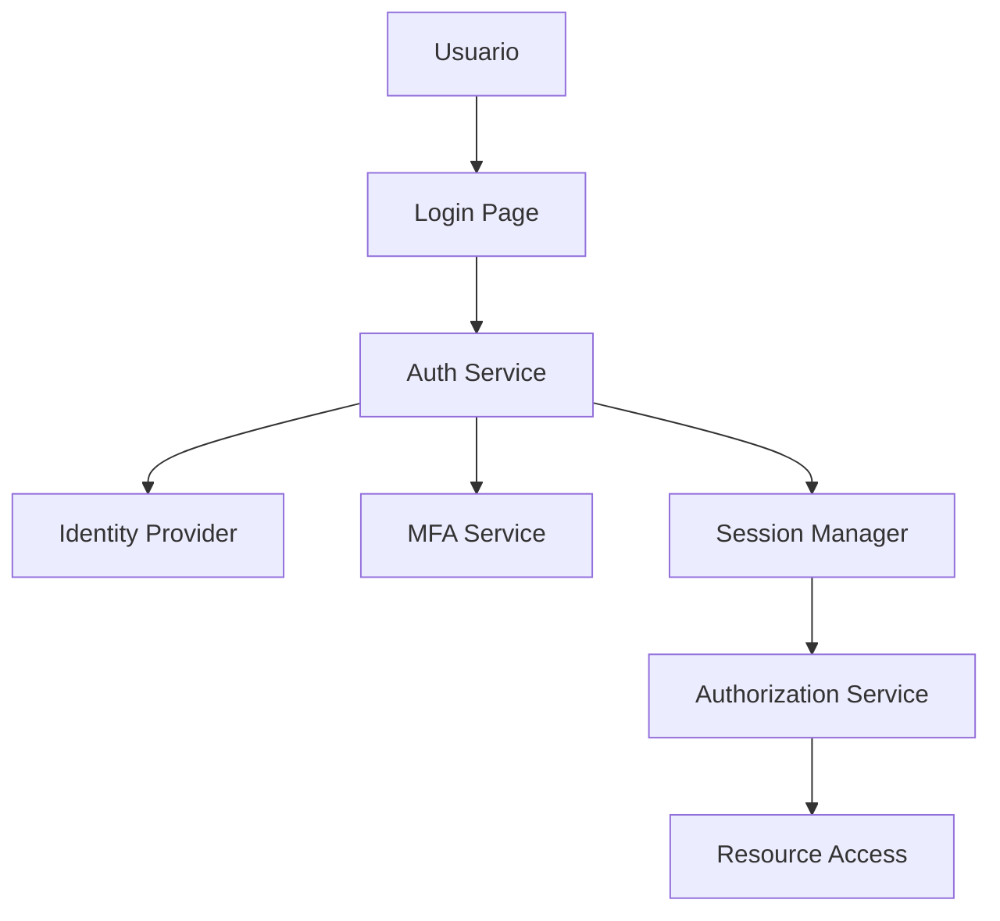

# Configuración de Autenticación y Autorización 🔐

## Descripción General

Este documento especifica la implementación completa del sistema de
autenticación y autorización para Club+, incluyendo configuraciones técnicas,
políticas de acceso y procedimientos de gestión de identidades.

## Arquitectura de Autenticación

### 🏗️ Componentes del Sistema



### Flujo de Autenticación

1. **Presentación de Credenciales**: Usuario/contraseña o OAuth
2. **Validación Primaria**: Verificación contra base de datos
3. **Multi-Factor Authentication**: TOTP, SMS, o hardware key
4. **Generación de Token**: JWT con claims específicos
5. **Establecimiento de Sesión**: Sesión segura establecida
6. **Autorización Continua**: Evaluación de permisos por request

## Métodos de Autenticación

### 🔑 Autenticación Primaria

#### Username/Password

```yaml
Password Requirements:
  min_length: 12
  max_length: 128
  require_uppercase: true
  require_lowercase: true
  require_numbers: true
  require_symbols: true
  prohibit_dictionary: true
  prohibit_personal_info: true
  history_count: 12
  max_age_days: 90
```

#### OAuth 2.0 / OpenID Connect

```yaml
Supported Providers:
  - Google Workspace
  - Microsoft Azure AD
  - GitHub Enterprise
  - LinkedIn
  - Custom OIDC providers

Configuration:
  grant_types:
    - authorization_code
    - refresh_token
  response_types:
    - code
  scopes:
    - openid
    - profile
    - email
  token_endpoint_auth: client_secret_post
  pkce: required
```

#### SAML 2.0 SSO

```yaml
SAML Configuration:
  binding: HTTP-POST
  signature_algorithm: RSA-SHA256
  digest_algorithm: SHA256
  authn_context: PasswordProtectedTransport
  assertion_encryption: true
  response_signing: true

Supported IDPs:
  - Active Directory Federation Services
  - Okta
  - Ping Identity
  - Auth0
  - Custom SAML providers
```

### 🛡️ Multi-Factor Authentication (MFA)

#### TOTP (Time-based OTP)

```yaml
TOTP Configuration:
  issuer: 'Club+'
  algorithm: SHA1
  digits: 6
  period: 30
  window: 1

Supported Apps:
  - Google Authenticator
  - Authy
  - Microsoft Authenticator
  - 1Password
  - LastPass Authenticator
```

#### SMS Authentication

```yaml
SMS Provider: Twilio
Configuration:
  country_codes: ['+1', '+34', '+52', '+44', '+49']
  message_template: 'Club+ verification code: {code}'
  code_length: 6
  expiry_minutes: 5
  max_attempts: 3
  rate_limit: 1 per minute
```

#### Hardware Security Keys

```yaml
FIDO2/WebAuthn Support:
  algorithms:
    - ES256 (ECDSA w/ SHA-256)
    - RS256 (RSASSA-PKCS1-v1_5 w/ SHA-256)
  attestation_formats:
    - packed
    - fido-u2f
  authenticator_attachment: any
  user_verification: required

Supported Keys:
  - YubiKey 5 Series
  - Google Titan Security Keys
  - Feitian FIDO Keys
  - SoloKeys
```

#### Backup Codes

```yaml
Backup Codes:
  count: 10
  length: 8
  character_set: 'ABCDEFGHIJKLMNPQRSTUVWXYZ23456789'
  single_use: true
  regeneration: after_50%_used
  expiry: 1_year
```

## Sistema de Autorización

### 🎭 Modelo de Control de Acceso

#### Role-Based Access Control (RBAC)

```yaml
Default Roles:
  super_admin:
    description: 'Full system access'
    permissions: ['*']
    assignment_requires: ['super_admin_approval', 'background_check']

  admin:
    description: 'Administrative access'
    permissions:
      - 'users.manage'
      - 'roles.assign'
      - 'settings.configure'
      - 'reports.view_all'
    assignment_requires: ['admin_approval']

  manager:
    description: 'Team management access'
    permissions:
      - 'users.view_team'
      - 'projects.manage_assigned'
      - 'reports.view_team'
    assignment_requires: ['manager_approval']

  user:
    description: 'Standard user access'
    permissions:
      - 'profile.manage_own'
      - 'content.create'
      - 'projects.view_assigned'
    assignment_requires: ['self_registration']

  guest:
    description: 'Limited read-only access'
    permissions:
      - 'content.view_public'
    assignment_requires: ['invitation']
```

#### Attribute-Based Access Control (ABAC)

```yaml
Attributes:
  Subject:
    - user.id
    - user.role
    - user.department
    - user.clearance_level
    - user.location

  Resource:
    - resource.type
    - resource.owner
    - resource.classification
    - resource.project

  Action:
    - action.type (read, write, delete, execute)
    - action.time
    - action.source_ip

  Environment:
    - time.hour
    - location.country
    - network.trusted
    - device.managed
```

### 📋 Políticas de Autorización

#### Política de Acceso por Defecto

```json
{
  "version": "1.0",
  "statement": [
    {
      "effect": "Deny",
      "principal": "*",
      "action": "*",
      "resource": "*",
      "condition": {
        "default": true
      }
    }
  ]
}
```

#### Política de Recursos Críticos

```json
{
  "version": "1.0",
  "statement": [
    {
      "effect": "Allow",
      "principal": {
        "role": ["super_admin"]
      },
      "action": "*",
      "resource": "arn:club:*:critical/*"
    },
    {
      "effect": "Allow",
      "principal": {
        "role": ["admin"]
      },
      "action": ["read", "update"],
      "resource": "arn:club:*:critical/*",
      "condition": {
        "mfa_verified": true,
        "source_ip": {
          "cidr": ["10.0.0.0/8", "172.16.0.0/12"]
        }
      }
    }
  ]
}
```

## Configuraciones Técnicas

### 🔧 JWT Configuration

#### Token Structure

```yaml
JWT Configuration:
  algorithm: RS256
  issuer: 'https://auth.clubplus.app'
  audience: 'clubplus-api'

Access Token:
  expiry: 1_hour
  refresh_before_expiry: 10_minutes

Refresh Token:
  expiry: 30_days
  rotation: true
  family_tracking: true

ID Token:
  expiry: 1_hour
  include_profile: true
  custom_claims:
    - role
    - permissions
    - mfa_verified
```

#### Claims Structure

```json
{
  "iss": "https://auth.clubplus.app",
  "aud": "clubplus-api",
  "sub": "user_123456",
  "iat": 1692000000,
  "exp": 1692003600,
  "email": "user@example.com",
  "role": "manager",
  "permissions": ["users.view_team", "projects.manage_assigned"],
  "mfa_verified": true,
  "device_id": "device_789",
  "session_id": "session_abc123"
}
```

### 🗄️ Database Schema

#### Users Table

```sql
CREATE TABLE users (
    id UUID PRIMARY KEY DEFAULT gen_random_uuid(),
    email VARCHAR(255) UNIQUE NOT NULL,
    password_hash VARCHAR(255),
    first_name VARCHAR(100),
    last_name VARCHAR(100),
    phone VARCHAR(20),
    email_verified BOOLEAN DEFAULT false,
    phone_verified BOOLEAN DEFAULT false,
    mfa_enabled BOOLEAN DEFAULT false,
    mfa_secret VARCHAR(32),
    backup_codes TEXT[],
    failed_login_attempts INTEGER DEFAULT 0,
    locked_until TIMESTAMP,
    last_login TIMESTAMP,
    password_changed_at TIMESTAMP,
    created_at TIMESTAMP DEFAULT NOW(),
    updated_at TIMESTAMP DEFAULT NOW(),
    deleted_at TIMESTAMP
);

CREATE INDEX idx_users_email ON users(email);
CREATE INDEX idx_users_phone ON users(phone);
CREATE INDEX idx_users_deleted_at ON users(deleted_at);
```

#### Roles and Permissions

```sql
CREATE TABLE roles (
    id UUID PRIMARY KEY DEFAULT gen_random_uuid(),
    name VARCHAR(50) UNIQUE NOT NULL,
    description TEXT,
    is_system BOOLEAN DEFAULT false,
    created_at TIMESTAMP DEFAULT NOW()
);

CREATE TABLE permissions (
    id UUID PRIMARY KEY DEFAULT gen_random_uuid(),
    name VARCHAR(100) UNIQUE NOT NULL,
    description TEXT,
    resource VARCHAR(50),
    action VARCHAR(50),
    created_at TIMESTAMP DEFAULT NOW()
);

CREATE TABLE role_permissions (
    role_id UUID REFERENCES roles(id) ON DELETE CASCADE,
    permission_id UUID REFERENCES permissions(id) ON DELETE CASCADE,
    PRIMARY KEY (role_id, permission_id)
);

CREATE TABLE user_roles (
    user_id UUID REFERENCES users(id) ON DELETE CASCADE,
    role_id UUID REFERENCES roles(id) ON DELETE CASCADE,
    assigned_by UUID REFERENCES users(id),
    assigned_at TIMESTAMP DEFAULT NOW(),
    expires_at TIMESTAMP,
    PRIMARY KEY (user_id, role_id)
);
```

#### Sessions and Tokens

```sql
CREATE TABLE user_sessions (
    id UUID PRIMARY KEY DEFAULT gen_random_uuid(),
    user_id UUID REFERENCES users(id) ON DELETE CASCADE,
    device_id VARCHAR(100),
    device_name VARCHAR(100),
    ip_address INET,
    user_agent TEXT,
    refresh_token_hash VARCHAR(255),
    expires_at TIMESTAMP,
    created_at TIMESTAMP DEFAULT NOW(),
    last_accessed TIMESTAMP DEFAULT NOW()
);

CREATE TABLE mfa_tokens (
    id UUID PRIMARY KEY DEFAULT gen_random_uuid(),
    user_id UUID REFERENCES users(id) ON DELETE CASCADE,
    token_type VARCHAR(20) NOT NULL, -- 'totp', 'sms', 'backup'
    token_value VARCHAR(255) NOT NULL,
    used BOOLEAN DEFAULT false,
    expires_at TIMESTAMP,
    created_at TIMESTAMP DEFAULT NOW()
);
```

### 🔐 Security Headers

#### Web Security Configuration

```nginx
# Security Headers
add_header X-Content-Type-Options nosniff;
add_header X-Frame-Options DENY;
add_header X-XSS-Protection "1; mode=block";
add_header Referrer-Policy "strict-origin-when-cross-origin";
add_header Permissions-Policy "geolocation=(), microphone=(), camera=()";

# Content Security Policy
add_header Content-Security-Policy "
    default-src 'self';
    script-src 'self' 'unsafe-inline' https://apis.google.com;
    style-src 'self' 'unsafe-inline' https://fonts.googleapis.com;
    font-src 'self' https://fonts.gstatic.com;
    img-src 'self' data: https://*.amazonaws.com;
    connect-src 'self' https://api.clubplus.app;
    frame-ancestors 'none';
    base-uri 'self';
    form-action 'self';
";

# HTTP Strict Transport Security
add_header Strict-Transport-Security "max-age=31536000; includeSubDomains; preload";
```

## Implementación de APIs

### 🔌 Authentication Endpoints

#### POST /api/auth/login

```yaml
Request:
  email: string (required)
  password: string (required)
  remember_me: boolean (optional, default: false)
  device_id: string (optional)

Response (Success):
  access_token: string
  refresh_token: string
  expires_in: number
  token_type: "Bearer"
  user: object
  mfa_required: boolean

Response (MFA Required):
  mfa_token: string
  mfa_methods: array
  message: "MFA verification required"
```

#### POST /api/auth/mfa/verify

```yaml
Request:
  mfa_token: string (required)
  code: string (required)
  method: string (required) # 'totp', 'sms', 'backup'

Response:
  access_token: string
  refresh_token: string
  expires_in: number
  token_type: 'Bearer'
  user: object
```

#### POST /api/auth/refresh

```yaml
Request:
  refresh_token: string (required)

Response:
  access_token: string
  refresh_token: string (optional, if rotation enabled)
  expires_in: number
  token_type: 'Bearer'
```

### 🛡️ Authorization Middleware

#### Express.js Implementation

```javascript
const jwt = require('jsonwebtoken');
const { promisify } = require('util');

const authenticate = async (req, res, next) => {
  try {
    const token = extractToken(req);
    if (!token) {
      return res.status(401).json({ error: 'Authentication required' });
    }

    const decoded = jwt.verify(token, process.env.JWT_PUBLIC_KEY, {
      algorithms: ['RS256'],
      issuer: 'https://auth.clubplus.app',
      audience: 'clubplus-api',
    });

    // Verify token in database (for revocation)
    const session = await Session.findByToken(decoded.jti);
    if (!session || session.expires_at < new Date()) {
      return res.status(401).json({ error: 'Invalid or expired token' });
    }

    req.user = decoded;
    req.session = session;
    next();
  } catch (error) {
    return res.status(401).json({ error: 'Invalid token' });
  }
};

const authorize = (permissions = []) => {
  return (req, res, next) => {
    const userPermissions = req.user.permissions || [];

    const hasPermission = permissions.every(
      permission =>
        userPermissions.includes(permission) || userPermissions.includes('*'),
    );

    if (!hasPermission) {
      return res.status(403).json({
        error: 'Insufficient permissions',
        required: permissions,
        current: userPermissions,
      });
    }

    next();
  };
};
```

## Monitoreo y Auditoría

### 📊 Métricas de Autenticación

#### Login Metrics

```yaml
Tracked Events:
  - successful_login
  - failed_login
  - password_reset_requested
  - password_reset_completed
  - mfa_enabled
  - mfa_disabled
  - account_locked
  - account_unlocked

Metrics to Monitor:
  - Login success rate
  - Failed login attempts per user
  - MFA adoption rate
  - Session duration average
  - Concurrent sessions per user
```

#### Security Alerts

```yaml
Alert Conditions:
  brute_force:
    threshold: 5 failed attempts in 15 minutes
    action: temporary_account_lock
    duration: 30 minutes

  suspicious_location:
    condition: login from new country
    action: require_mfa_reverification
    notification: email_user

  concurrent_sessions:
    threshold: 5 active sessions
    action: terminate_oldest_sessions
    notification: security_team

  privilege_escalation:
    condition: role_assignment_to_admin
    action: require_approval
    notification: security_team
```

### 🔍 Audit Logging

#### Authentication Events

```json
{
  "timestamp": "2025-08-13T10:00:00Z",
  "event_type": "authentication",
  "event_name": "login_success",
  "user_id": "123456",
  "session_id": "session_abc123",
  "ip_address": "192.168.1.100",
  "user_agent": "Mozilla/5.0...",
  "mfa_method": "totp",
  "device_id": "device_789",
  "location": {
    "country": "US",
    "city": "San Francisco",
    "coordinates": [37.7749, -122.4194]
  }
}
```

#### Authorization Events

```json
{
  "timestamp": "2025-08-13T10:05:00Z",
  "event_type": "authorization",
  "event_name": "permission_granted",
  "user_id": "123456",
  "resource": "users.manage",
  "action": "view",
  "result": "allowed",
  "policy_evaluated": "rbac_manager_policy",
  "request_id": "req_xyz789"
}
```

## Configuración por Entorno

### 🏗️ Development

```yaml
Environment: development
Authentication:
  password_complexity: reduced
  mfa_required: false
  session_timeout: 8_hours
  jwt_expiry: 24_hours

Security:
  https_required: false
  csrf_protection: disabled
  rate_limiting: disabled
```

### 🧪 Staging

```yaml
Environment: staging
Authentication:
  password_complexity: full
  mfa_required: true
  session_timeout: 4_hours
  jwt_expiry: 1_hour

Security:
  https_required: true
  csrf_protection: enabled
  rate_limiting: enabled
```

### 🚀 Production

```yaml
Environment: production
Authentication:
  password_complexity: full
  mfa_required: true
  session_timeout: 1_hour
  jwt_expiry: 15_minutes

Security:
  https_required: true
  csrf_protection: enabled
  rate_limiting: strict
  session_pinning: enabled
  device_fingerprinting: enabled
```

## Mantenimiento y Actualizaciones

### 🔄 Rotación de Claves

- **JWT Signing Keys**: Rotación mensual
- **Encryption Keys**: Rotación trimestral
- **API Keys**: Rotación semestral
- **Database Encryption**: Rotación anual

### 📋 Revisiones de Acceso

- **Usuarios Activos**: Revisión mensual
- **Roles Asignados**: Revisión trimestral
- **Permisos Críticos**: Revisión mensual
- **Cuentas de Servicio**: Revisión semestral

---

**Responsable**: Security Team + Identity Team  
**Última actualización**: 13 de agosto de 2025  
**Versión**: 1.0  
**Próxima revisión**: 13 de octubre de 2025
